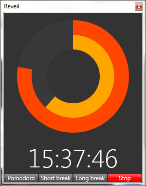

# Reveil
Reveil is a desktop alarm clock and pomodoro clock. The infrastructure is written in C# using UWP. The Application is an **unofficial application of the Pomodoro Technique®**. 

## Credits
* [WPF Loading Wait Adorner](http://www.codeproject.com/Articles/57984/WPF-Loading-Wait-Adorner), Jeremy Hutchinson, 2010-02-10
* [Better WPF Circular Progress Bar](https://www.codeproject.com/Articles/49853/Better-WPF-Circular-Progress-Bar), Sacha Barber, 2010-01-04
* [MVVM Light Toolkit](http://www.mvvmlight.net/), Laurent Bugnion, 2016-04-27
* [HealthClinic.biz](https://github.com/Microsoft/HealthClinic.biz)
* [TimePicker](https://marlongrech.wordpress.com/2007/11/18/time-picker/), Marlon Grech, 2007-11-18
